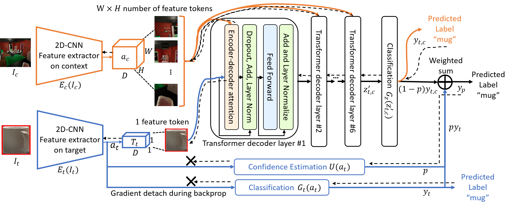

<div align="center">
  

  <h4>The Context-aware Recognition Transformer Network</h4>

  <a href="#about">About</a> •
  <a href="#crtnet-model">CRTNet Model</a> •
  <a href="#code-architecture">Code Architecture</a> •
  <a href="#citation">Citation</a>
</div>


---

## About

Conventional object recognition models are designed for images that are focused on a single object. While it is of course always possible to crop a large image to an object of interest, a lot of potentially valuable contextual information is sacrificed in that process. As our experiments show, humans are able to make use of additional context to reason about the object of interest and achieve considerably higher recognition performance.

Our Context-aware Recognition Transfomer (CRTNet) is designed to shrink this gap between human and computer vision capabilities by looking at the big picture and leveraging the contextual information.


## CRTNet Model
<div align="center">
  
</div>


CRTNet is presented with an image containing multiple objects
and a bounding box to indicate the target object location.
Inspired by the eccentricity dependence of human vision,
CRTNet has one stream that processes only the target
object (I<sub>t</sub> , 224 × 224), and a second stream devoted to the
periphery (I<sub>c</sub> , 224 × 224). I<sub>t</sub> is obtained by cropping the
input image to the bounding box whereas I<sub>c</sub> covers the
entire contextual area of the image. I<sub>c</sub> and I<sub>t</sub> are then
resized to the same dimensions. Thus, the target object’s
resolution is higher in I<sub>t</sub> . The two streams are encoded
through two separate 2D-CNNs. After the encoding stage,
CRTNet tokenizes the feature maps of I<sub>t</sub> and I<sub>c</sub> , integrates
object and context information via hierarchical reasoning
through a stack of transformer decoder layers, and predicts
class label probabilities y<sub>t,c</sub> within C classes.

A model that always relies on context can make mistakes
under unusual context. To increase robustness, CRTNet
makes a second prediction y<sub>t</sub> , based on target object
information alone, estimates the confidence p of this
prediction, and computes a confidence-weighted average of
y<sub>t</sub> and y<sub>t,c</sub> to get the final prediction y<sub>p</sub> . If the model makes
a confident prediction with the object only, it can overrule the
context reasoning stage.

## Code Architecture

- All relevant components are implemented in `core/`.
- We use COCO-style annotations for train and test sets. An example can be found in the `debug/` folder.
- Training and testing can be performed with `train.py` and `test.py` respectively. Annotations, image directory and relevant parameters should be set via command line arguments. Available command line arguments can be displayed by running `python train.py --help` and `python test.py --help` respectively.


#### Examples

Train model with default settings using the specified annotations and images. Outputs including a config and model checkpoints are saved to the directory specified via `--outdir`.
```
python train.py --annotations debug/annotations.json --imagedir debug/images --outdir output
```

Test a trained model on a dataset with the given annotations and images.
```
python test.py --checkpoint output/checkpoint_1.tar --config output/config.yaml
--annotations testset/annotations.json --imagedir testset/images --weighted_prediction
```

## Citation

> TODO

The images for the sample dataset in the `debug` folder were generated with VirtualHome (see http://virtual-home.org/).